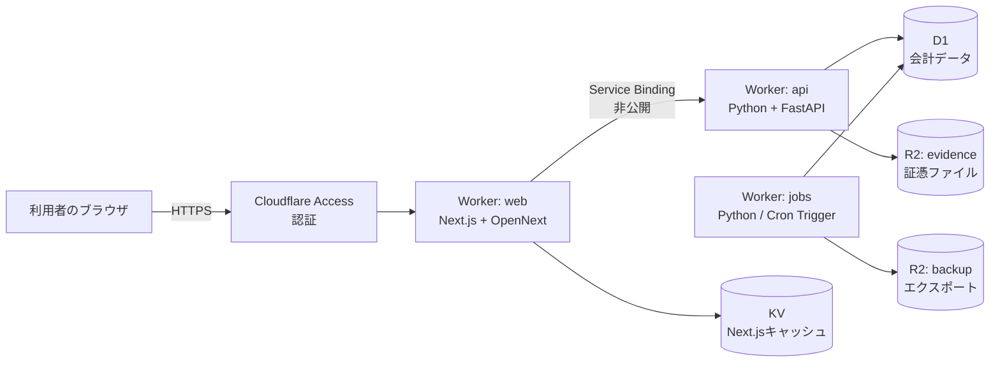

# 設計書：マイクロ法人向け最小構成会計ソフト（Cloudflare構成）

- 文書バージョン: 1.0
- 作成日: 2026-09-27
- 対応する要件定義書: `micro_llc_accounting_requirements.md` v1.0
- 前提: Cloudflare Workers Paid プラン（月額5ドル）

---

## 0. この文書の読み方（実装担当LLM向け）

- 要件ID（`FR-` `DM-` `BR-` `NFR-` `OUT-`）は要件定義書のものを指す。
- 設計上の決定には `AD-`（Architecture Decision）のIDを付ける。
- 実装時に動作確認が必要な箇所には `【要検証】` を付けている。確認できなかった場合は、その項に書いた代替案に切り替えること。
- 金額はすべて円単位の整数（SQLiteの `INTEGER`）で扱う。浮動小数点型は使わない。
- 日付は日本時間の `YYYY-MM-DD` 文字列で保存する。日時は ISO 8601（`+09:00` 付き）で保存する。

---

## 1. 全体構成

### 1.1 構成図



### 1.2 コンポーネント一覧

| 名前 | 種類 | 役割 | 公開範囲 |
|---|---|---|---|
| web | Worker（Next.js、OpenNextアダプター） | 画面表示。APIへの中継 | Cloudflare Access 経由のみ |
| api | Worker（Python Workers、FastAPI） | 業務ロジック、税務ルールの判定、D1・R2への読み書き | 公開しない。web からの Service Binding のみ |
| jobs | Worker（Python Workers、Cron Trigger） | バックアップ、期限通知の計算 | 公開しない |
| DB | D1（データベース名 `ledger`） | 会計データ | api と jobs のみがバインド |
| evidence | R2 バケット | 証憑ファイル | api のみがバインド |
| backup | R2 バケット | D1のエクスポート | jobs のみがバインド |
| NEXT_CACHE | KV 名前空間 | OpenNextのキャッシュ | web のみがバインド |

### 1.3 設計上の決定

| ID | 決定内容 | 理由 |
|---|---|---|
| AD-01 | ホスティングは Cloudflare Workers に統一する | 月5ドル程度に収まる。サーバーOSの保守が不要 |
| AD-02 | Next.js は OpenNext アダプターで Workers に載せる | Cloudflare は新規には vinext を推奨しているが、vinext はベータ版のため。vinext が正式版になったら移行を検討する |
| AD-03 | バックエンドは Python Workers 上の FastAPI とする | 税務ルールの判定を Python で書き、CPython の pytest で単体テストできるようにするため |
| AD-04 | api は公開せず、web からの Service Binding でのみ呼ぶ | 認証を web の前段（Cloudflare Access）の1か所に集約するため |
| AD-05 | DB は D1 とし、SQLAlchemy・Alembic は使わない | D1 はバインディング経由の接続で、通常の SQLite ドライバを使えないため。スキーマの変更は wrangler の D1 マイグレーション機能で管理する |
| AD-06 | 証憑は R2 に置き、D1 にはキーとハッシュ値だけを保存する | D1 の1行あたりの上限（2MB）とデータベース容量を消費しないため |
| AD-07 | 7年間の保存は、D1 の Time Travel ではなく R2 へのエクスポートで担保する | Time Travel で戻せるのは30日前までのため（NFR-01） |
| AD-08 | 税率・控除率・しきい値は D1 の設定テーブルに持ち、コードに直書きしない | BR-000 |

---

## 2. リポジトリ構成

```
accounting/
├── apps/
│   ├── web/                     # Next.js（App Router、TypeScript）
│   │   ├── app/                 # 画面
│   │   ├── lib/api-client.ts    # api Worker 呼び出し（Service Binding）
│   │   ├── open-next.config.ts
│   │   └── wrangler.jsonc
│   ├── api/                     # Python Workers（FastAPI）
│   │   ├── src/
│   │   │   ├── main.py          # FastAPI アプリと ASGI エントリポイント
│   │   │   ├── routers/         # 画面単位のAPI
│   │   │   ├── repositories/    # D1 への SQL（ここ以外で SQL を書かない）
│   │   │   ├── storage/         # R2 の読み書き
│   │   │   └── domain/          # 業務ロジック（Workers に依存しない純粋な Python）
│   │   │       ├── rules/       # BR-xxx の実装。1ルール1モジュール
│   │   │       ├── journal.py
│   │   │       ├── payroll.py
│   │   │       ├── housing.py
│   │   │       ├── assets.py
│   │   │       └── reports/     # OUT-xxx の集計
│   │   ├── tests/               # CPython の pytest で domain/ をテスト
│   │   ├── pyproject.toml
│   │   └── wrangler.jsonc
│   └── jobs/                    # Python Workers（Cron Trigger）
│       ├── src/main.py
│       └── wrangler.jsonc
├── migrations/                  # D1 マイグレーション（0001_init.sql など）
├── seed/                        # 勘定科目・税区分・設定値の初期データ
└── .github/workflows/deploy.yml
```

- `domain/` は Cloudflare の API を import しない。テストはローカルの CPython で実行し、Workers 上では同じコードを Pyodide で動かす。
- `repositories/` と `storage/` だけが D1・R2 のバインディングに触れる。

---

## 3. 各 Worker の設定

### 3.1 web（Next.js）

```jsonc
// apps/web/wrangler.jsonc
{
  "name": "accounting-web",
  "main": ".open-next/worker.js",
  "compatibility_date": "2026-09-27",
  "compatibility_flags": ["nodejs_compat"],
  "assets": { "directory": ".open-next/assets", "binding": "ASSETS" },
  "services": [{ "binding": "API", "service": "accounting-api" }],
  "kv_namespaces": [{ "binding": "NEXT_CACHE", "id": "<KV_ID>" }]
}
```

- すべての画面を認証の内側に置く。ISR などの静的キャッシュは使わず、会計データは毎回 API から取得する。
- api の呼び出しは `lib/api-client.ts` に集約し、Server Components・Route Handlers から `env.API.fetch()` で呼ぶ。
- ブラウザから api を直接呼ばない。

### 3.2 api（Python、FastAPI）

```jsonc
// apps/api/wrangler.jsonc
{
  "name": "accounting-api",
  "main": "src/main.py",
  "compatibility_date": "2026-09-27",
  "compatibility_flags": ["python_workers"],
  "workers_dev": false,
  "d1_databases": [{ "binding": "DB", "database_name": "ledger", "database_id": "<D1_ID>", "migrations_dir": "../../migrations" }],
  "r2_buckets": [{ "binding": "EVIDENCE", "bucket_name": "accounting-evidence" }]
}
```

```python
# apps/api/src/main.py（骨子）
from fastapi import FastAPI
from workers import asgi
from routers import journals, attachments, payroll, housing, assets, reports, settings

app = FastAPI()
for r in (journals, attachments, payroll, housing, assets, reports, settings):
    app.include_router(r.router)

Default = asgi.entrypoint(app)
```

- `workers_dev: false` とし、ルート（公開URL）も設定しない。
- 依存パッケージは FastAPI と Pydantic に限定して始める。追加する場合は、Pyodide 向けのビルドがあるかを先に確認する。

### 3.3 jobs（Python、Cron Trigger）

```jsonc
// apps/jobs/wrangler.jsonc
{
  "name": "accounting-jobs",
  "main": "src/main.py",
  "compatibility_date": "2026-09-27",
  "compatibility_flags": ["python_workers"],
  "workers_dev": false,
  "triggers": { "crons": ["0 18 * * *"] },
  "d1_databases": [{ "binding": "DB", "database_name": "ledger", "database_id": "<D1_ID>" }],
  "r2_buckets": [{ "binding": "BACKUP", "bucket_name": "accounting-backup" }]
}
```

- Cron の時刻は UTC で指定する。上の例は日本時間の毎日3時。

---

## 4. 認証とセキュリティ

| 項目 | 設計 | 対応要件 |
|---|---|---|
| 認証 | Cloudflare Access（Zero Trust）で web の前段を保護する。許可するのは利用者本人のメールアドレス1件のみ | NFR-06 |
| 二重チェック | web は、Access が付与する `Cf-Access-Jwt-Assertion` ヘッダーの JWT を検証する。検証に失敗したら 403 を返す | NFR-06 |
| API の非公開化 | api と jobs には公開URLを持たせない（AD-04） | NFR-06 |
| 保存データの暗号化 | D1・R2 のプロバイダ側での保存時暗号化に依拠する | NFR-06 |
| マイナンバー | テーブルを作らず、入力欄も設けない | NFR-05 |
| 秘密情報 | 通知先などの設定は `wrangler secret` で登録し、リポジトリに置かない | — |

---

## 5. データベース設計（D1）

### 5.1 方針

- 要件定義書の DM-01〜DM-17 を1エンティティ1テーブルに対応させる。
- 主キーは `TEXT`（ULID）とする。
- 物理削除はしない。取消しは `voided_at` を設定し、必要なら逆仕訳を作る（NFR-01、NFR-02）。
- すべての業務テーブルの更新を、トリガーで `audit_log` に記録する（NFR-02）。
- 締め済み期間の仕訳の変更は、トリガーで拒否する（NFR-03）。

### 5.2 主要テーブルの DDL（`migrations/0001_init.sql` の抜粋）

```sql
-- 設定値（BR-000）
CREATE TABLE rule_settings (
  key            TEXT NOT NULL,          -- 例: 'invoice_transitional_rate'
  value          TEXT NOT NULL,          -- JSON文字列で保存（数値・配列など）
  effective_from TEXT NOT NULL,          -- YYYY-MM-DD
  effective_to   TEXT,                   -- NULL は期限なし
  note           TEXT,
  PRIMARY KEY (key, effective_from)
);

-- 会計期間（DM-03）
CREATE TABLE fiscal_periods (
  id         TEXT PRIMARY KEY,
  start_date TEXT NOT NULL,
  end_date   TEXT NOT NULL,
  status     TEXT NOT NULL CHECK (status IN ('open','closing','closed'))
);

-- 勘定科目（DM-04）
CREATE TABLE accounts (
  code                   TEXT PRIMARY KEY,
  name                   TEXT NOT NULL,
  category               TEXT NOT NULL CHECK (category IN ('asset','liability','equity','revenue','expense')),
  statement_section      TEXT NOT NULL,
  default_tax_code       TEXT NOT NULL REFERENCES tax_codes(code),
  requires_counterparty  INTEGER NOT NULL DEFAULT 0,
  is_active              INTEGER NOT NULL DEFAULT 1
);

-- 仕訳ヘッダ（DM-08）
CREATE TABLE journal_entries (
  id                  TEXT PRIMARY KEY,
  fiscal_period_id    TEXT NOT NULL REFERENCES fiscal_periods(id),
  transaction_date    TEXT NOT NULL,
  description         TEXT NOT NULL,
  counterparty_id     TEXT REFERENCES counterparties(id),
  payment_account_id  TEXT REFERENCES payment_accounts(id),
  entertainment_json  TEXT,               -- {participants, headcount, is_food_and_drink}
  source              TEXT NOT NULL CHECK (source IN ('manual','csv_import','recurring','closing_adjustment')),
  reverses_entry_id   TEXT REFERENCES journal_entries(id),  -- 逆仕訳の場合の元仕訳
  voided_at           TEXT,
  created_at          TEXT NOT NULL,
  updated_at          TEXT NOT NULL
);
CREATE INDEX idx_je_date ON journal_entries(transaction_date);
CREATE INDEX idx_je_counterparty ON journal_entries(counterparty_id);

-- 仕訳明細（DM-08）
CREATE TABLE journal_lines (
  id            TEXT PRIMARY KEY,
  entry_id      TEXT NOT NULL REFERENCES journal_entries(id),
  line_no       INTEGER NOT NULL,
  side          TEXT NOT NULL CHECK (side IN ('debit','credit')),
  account_code  TEXT NOT NULL REFERENCES accounts(code),
  amount        INTEGER NOT NULL CHECK (amount >= 0),
  tax_code      TEXT NOT NULL REFERENCES tax_codes(code),
  tax_amount    INTEGER NOT NULL DEFAULT 0,
  deductible_rate_pct INTEGER,           -- 経過措置の控除率（BR-022で決定し保存）
  UNIQUE (entry_id, line_no)
);
CREATE INDEX idx_jl_account ON journal_lines(account_code);

-- 証憑（DM-09）
CREATE TABLE attachments (
  id                 TEXT PRIMARY KEY,
  r2_key             TEXT NOT NULL UNIQUE,
  sha256             TEXT NOT NULL,
  content_type       TEXT NOT NULL,
  size_bytes         INTEGER NOT NULL,
  received_date      TEXT NOT NULL,
  transaction_date   TEXT NOT NULL,
  amount             INTEGER NOT NULL,
  counterparty_name  TEXT NOT NULL,
  receipt_channel    TEXT NOT NULL CHECK (receipt_channel IN ('electronic','paper_scanned','paper')),
  created_at         TEXT NOT NULL
);
CREATE INDEX idx_att_search ON attachments(transaction_date, amount, counterparty_name);

CREATE TABLE journal_attachments (
  entry_id      TEXT NOT NULL REFERENCES journal_entries(id),
  attachment_id TEXT NOT NULL REFERENCES attachments(id),
  PRIMARY KEY (entry_id, attachment_id)
);

-- 変更履歴（NFR-02）
CREATE TABLE audit_log (
  id          INTEGER PRIMARY KEY AUTOINCREMENT,
  table_name  TEXT NOT NULL,
  row_id      TEXT NOT NULL,
  action      TEXT NOT NULL CHECK (action IN ('insert','update','void')),
  before_json TEXT,
  after_json  TEXT,
  changed_at  TEXT NOT NULL
);
```

残りのテーブル（`company`, `consumption_tax_settings`, `tax_codes`, `counterparties`, `payment_accounts`, `sales_invoices`, `officers`, `officer_compensations`, `payroll_records`, `withholding_payments`, `year_end_adjustments`, `company_housings`, `fixed_assets`, `closing_carryovers`）は、要件定義書のフィールド定義をそのまま列にする。型の対応は次のとおり。

| 要件定義書の型 | D1（SQLite）の型 |
|---|---|
| string, date, enum | TEXT（enum は CHECK 制約で値を限定） |
| int | INTEGER |
| decimal | TEXT（`"0.10"` のような文字列で保存し、Python の `Decimal` で計算） |
| bool | INTEGER（0 か 1） |
| ref(X) | TEXT（外部キー） |
| object, 配列 | TEXT（JSON文字列） |
| file | R2 のキー（TEXT） |

### 5.3 整合性を守るトリガー

```sql
-- 締め済み期間への変更を拒否（NFR-03）
CREATE TRIGGER trg_je_closed_period_update
BEFORE UPDATE ON journal_entries
WHEN (SELECT status FROM fiscal_periods WHERE id = OLD.fiscal_period_id) = 'closed'
BEGIN
  SELECT RAISE(ABORT, 'fiscal period is closed');
END;

-- 物理削除の禁止（NFR-01）
CREATE TRIGGER trg_je_no_delete
BEFORE DELETE ON journal_entries
BEGIN
  SELECT RAISE(ABORT, 'physical delete is not allowed; use voided_at');
END;
```

- 同様のトリガーを `journal_lines`、`attachments` にも作る。`journal_lines` のトリガーは、親の仕訳の会計期間の状態を参照して判定する。
- `audit_log` への記録は、業務テーブルごとに AFTER INSERT / AFTER UPDATE トリガーで行う。
- 【要検証】D1 で上記のトリガーが期待どおり動作すること。動作しない場合は、同じ制約を `repositories/` 層で必ず実施する。

### 5.4 借方・貸方の一致チェック（FR-11）

- SQLite のトリガーでは複数行をまとめた検証がしにくいため、アプリケーション側で行う。
- 仕訳の保存は、ヘッダと明細を D1 の `batch()` で1トランザクションとして書き込む。
- 書き込み前に `domain/journal.py` で借方合計と貸方合計の一致を検証し、一致しなければ 422 を返す。

### 5.5 D1 の制限への対応

| 制限 | 値（有料プラン） | 対応 |
|---|---|---|
| 1回の処理あたりのクエリ数 | 1,000 | 帳票の集計は SQL の GROUP BY で行い、行ごとのクエリを発行しない |
| 1クエリあたりのバインド変数 | 100 | CSV 取込の一括登録は、行を分割して `batch()` で送る |
| 1行の最大サイズ | 2MB | 証憑は R2 に置く（AD-06） |
| 1データベースの最大容量 | 10GB | 想定データ量（7年分で数十MB以下）に対して十分 |

---

## 6. 証憑ストレージ（R2）

- キーの形式: `evidence/{YYYY}/{MM}/{attachment_id}.{拡張子}`（YYYY-MM は取引年月）
- アップロードの流れ
  1. ブラウザから web にファイルを送る（multipart）。
  2. web は api にそのまま中継する。
  3. api は SHA-256 を計算し、R2 に保存してから `attachments` に行を追加する。
- ダウンロード時は api が R2 から読み出して返す。R2 の公開URLは作らない。
- R2 のバケットロック（保持期間の設定）で、保存から7年間はオブジェクトの削除と上書きを禁止する（NFR-01）。
  - 【要検証】バケットロックの設定方法と、保持期間の上限。
- ファイルサイズの上限は1ファイル20MBとし、api で検証する。

---

## 7. API 設計

### 7.1 共通仕様

- ベースパスは `/api/v1`。リクエストとレスポンスは JSON（証憑のアップロードのみ multipart）。
- 入力の検証は Pydantic のモデルで行う。
- エラーは `{ "error": { "code": "...", "message": "...", "rule_id": "BR-xxx" } }` の形で返す。業務ルール違反の場合は `rule_id` を付ける。
- 警告（エラーではないが利用者に知らせる事項）は、正常レスポンスの `warnings: [{ rule_id, message }]` で返す。

### 7.2 エンドポイント一覧

| メソッドとパス | 内容 | 対応要件 |
|---|---|---|
| GET / PUT `/company` | 会社設定 | FR-01, DM-01 |
| GET / PUT `/fiscal-periods/{id}/consumption-tax` | 消費税設定 | DM-02, BR-021 |
| GET / POST `/fiscal-periods` | 会計期間 | DM-03 |
| POST `/fiscal-periods/{id}/close` | 期末の締めと残高繰越 | FR-63 |
| GET / POST / PATCH `/accounts` | 勘定科目 | FR-02, DM-04 |
| GET / POST / PATCH `/counterparties` | 取引先 | DM-06 |
| GET / POST / PATCH `/payment-accounts` | 口座・支払手段 | DM-07 |
| GET `/journals?from=&to=&amount_min=&amount_max=&counterparty=&account=` | 仕訳の検索 | FR-70 |
| POST `/journals` | 仕訳の登録（税区分の自動判定、借貸一致の検証を含む） | FR-10〜12, FR-15, FR-17 |
| POST `/journals/{id}/void` | 仕訳の取消し（逆仕訳を作成） | NFR-02 |
| POST `/imports/bank-csv` | 明細CSVの取込と仕訳候補の作成 | FR-13 |
| GET / POST `/recurring-templates` | 定型仕訳 | FR-14 |
| POST `/attachments` | 証憑のアップロード | FR-16, BR-061 |
| GET `/attachments?from=&to=&amount_min=&amount_max=&counterparty=` | 証憑の検索 | FR-70 |
| GET `/attachments/{id}/file` | 証憑のダウンロード | FR-16 |
| GET / POST `/sales-invoices` | 請求書の作成（売掛金の仕訳を自動作成） | FR-20, FR-21 |
| POST `/sales-invoices/{id}/receipts` | 入金の消込 | FR-22 |
| GET / POST `/officers/{id}/compensations` | 役員報酬の改定履歴 | FR-30, BR-031 |
| GET / POST `/payroll` | 月次の給与支給実績と仕訳の自動作成 | FR-31, FR-32 |
| GET / PUT `/year-end-adjustments/{year}` | 年末調整 | FR-34 |
| GET / POST / PATCH `/housings` | 借上げ社宅 | FR-40〜42 |
| GET `/housings/{id}/imputed-rent` | 賃料相当額の計算結果 | BR-081 |
| GET / POST / PATCH `/fixed-assets` | 固定資産 | FR-50〜52 |
| POST `/fiscal-periods/{id}/depreciation` | 減価償却仕訳の作成 | FR-50 |
| GET `/reports/{report_id}?period_id=&format=json\|csv` | 帳票の出力 | OUT-01〜22 |
| GET `/deadlines?from=&to=` | 期限一覧 | 要件定義書 第7章 |
| GET / POST `/rule-settings` | 設定値の参照と追加 | BR-000 |
| POST `/exports` | 全データのエクスポート | FR-71 |

---

## 8. 業務ロジックの実装方針

### 8.1 ルールの実装

- `domain/rules/` に、要件定義書の BR ごとに1モジュールを置く（例: `br022_invoice_transitional.py`）。
- 各ルールは、判定に必要な値を引数で受け取る純粋関数として実装する。D1 から設定値を読む処理はルールの外（呼び出し側）で行う。

```python
# domain/rules/br022_invoice_transitional.py
from datetime import date

def deductible_rate_pct(transaction_date: date, has_invoice: bool,
                        schedule: list[tuple[date, date | None, int]]) -> int:
    """
    BR-022: 取引日に対応する仕入税額の控除率（%）を返す。
    schedule は rule_settings の 'invoice_transitional_rate' から作る
    (effective_from, effective_to, rate_pct) のリスト。
    """
    if has_invoice:
        return 100
    for start, end, rate in schedule:
        if start <= transaction_date and (end is None or transaction_date <= end):
            return rate
    return 0
```

- 各ルールには、要件定義書に書かれた境界値（例: 2026-09-30 と 2026-10-01、取得価額 399,999円と 400,000円）のテストケースを必ず用意する。

### 8.2 設定値の初期データ（`seed/rule_settings.sql` の抜粋）

```sql
INSERT INTO rule_settings (key, value, effective_from, effective_to, note) VALUES
('invoice_transitional_rate', '80', '2023-10-01', '2026-09-30', 'BR-022'),
('invoice_transitional_rate', '70', '2026-10-01', '2028-09-30', 'BR-022'),
('invoice_transitional_rate', '50', '2028-10-01', '2030-09-30', 'BR-022'),
('invoice_transitional_rate', '30', '2030-10-01', '2031-09-30', 'BR-022'),
('invoice_transitional_rate', '0',  '2031-10-01', NULL,          'BR-022'),
('small_asset_sme_limit', '300000', '2006-04-01', '2026-03-31', 'BR-051 取得日で判定'),
('small_asset_sme_limit', '400000', '2026-04-01', '2029-03-31', 'BR-051 取得日で判定'),
('small_asset_sme_annual_cap', '3000000', '2006-04-01', NULL, 'BR-051'),
('two_tenths_special_last_period_contains', '"2026-09-30"', '2023-10-01', NULL, 'BR-021'),
('entertainment_food_per_person_limit', '10000', '2024-04-01', NULL, 'BR-071'),
('entertainment_sme_fixed_limit', '8000000', '2013-04-01', NULL, 'BR-071');
```

- 源泉徴収税額表（FR-32）は `withholding_tables` テーブルに、適用年ごとの行データとして持つ。

### 8.3 金額の計算

- Python の `Decimal` で計算し、D1 に保存する前に円単位の整数に丸める。
- 端数処理は、ルールごとに定めた方法（切捨て・四捨五入）をルールのモジュール内で明示する。

---

## 9. 帳票の出力

| 帳票 | 生成方法 |
|---|---|
| 仕訳帳、総勘定元帳、補助簿、試算表（OUT-01〜06） | api が JSON と CSV を返す。画面は web で表として表示する |
| 決算書（OUT-10〜13） | api が集計値を JSON で返し、web で印刷用レイアウトの HTML を表示する。ブラウザの印刷機能で PDF にする |
| 請求書（OUT、FR-21） | 上と同じく印刷用 HTML から PDF にする |
| 内訳書・概況説明書・消費税集計表の元データ（OUT-14〜16） | CSV を出力する |
| 源泉徴収票など（OUT-20〜22） | 記載内容を HTML と CSV で出力する |

- PDF の生成を Workers 上で行わないのは、Python の PDF ライブラリが Pyodide で動くか不確実なため。
- 【要検証】将来サーバー側で PDF を生成する場合は、JavaScript の pdf-lib を web 側で使う案を優先して検討する。

---

## 10. バックアップとエクスポート

| 処理 | 実行契機 | 内容 | 対応要件 |
|---|---|---|---|
| 日次バックアップ | jobs の Cron（毎日） | 全テーブルを1テーブル1ファイルの JSON Lines にして、`backup/daily/{YYYY-MM-DD}/` に保存する | NFR-04 |
| 年次アーカイブ | 締め処理（FR-63）の完了時 | その期のデータを `backup/closed/{期末日}/` に保存する。このプレフィックスはバケットロックで7年間（欠損金のある期は10年間）削除を禁止する | NFR-01 |
| 手動エクスポート | 利用者の操作 | 全データ（JSON Lines と証憑）を ZIP にしてダウンロードする | FR-71 |
| 短期の復旧 | 障害時 | D1 の Time Travel で、30日以内の任意の時点に戻す | NFR-04 |

- 日次バックアップは90日分を残し、それより古いものは R2 のライフサイクルルールで削除する。
- 【要検証】全テーブルの読み出しが、1回の Cron 実行の CPU 時間の上限内に収まること。収まらない場合は、テーブルごとに処理を分けて実行する。

---

## 11. 期限通知

- jobs が毎日、要件定義書 第7章の期限一覧から、14日以内に期限が来るものを計算する。
- 通知は、web のトップ画面に表示する形で始める。メール通知は必要になった時点で追加する。

---

## 12. 開発とデプロイ

### 12.1 ローカル開発

| 対象 | コマンド | 補足 |
|---|---|---|
| web | `next dev` | `initOpenNextCloudflareForDev()` でローカルのバインディングを使う |
| web（Workers 上での確認） | `opennextjs-cloudflare build && opennextjs-cloudflare preview` | |
| api | `uv run pywrangler dev` | D1 と R2 はローカルのエミュレーションを使う |
| domain のテスト | `uv run pytest` | CPython で実行する |
| マイグレーション | `wrangler d1 migrations apply ledger --local` | |

### 12.2 環境

- 本番環境とローカル環境の2つとする。利用者1名のため、ステージング環境は作らない。
- 本番のマイグレーションの前に、必ず手動エクスポート（FR-71）を実行する。

### 12.3 デプロイ（GitHub Actions）

1. `pytest` で domain のテストを実行する。
2. `wrangler d1 migrations apply ledger --remote` でマイグレーションを適用する。
3. api と jobs を `pywrangler deploy` でデプロイする。
4. web を `opennextjs-cloudflare build && opennextjs-cloudflare deploy` でデプロイする。

- Cloudflare の API トークンは GitHub の Secrets に保存する。

---

## 13. 費用の見込み

| 項目 | 費用 |
|---|---|
| Workers Paid プラン | 月5ドル（Workers、D1、KV などの利用枠を含む） |
| D1 | 有料プランの利用枠内に収まる見込み |
| R2 | 証憑とバックアップで数GB程度。【要検証】R2 の無料枠と超過時の単価 |
| Cloudflare Access | 【要検証】利用者1名での料金 |
| ドメイン | 独自ドメインを使う場合のみ、その年額 |

---

## 14. 要件との対応表

| 要件 | 主に実装する場所 |
|---|---|
| DM-01〜17 | `migrations/`、`api/src/repositories/` |
| FR-01〜03 | `web/app/setup/`、`api/src/routers/settings.py` |
| FR-10〜17 | `api/src/routers/journals.py`、`domain/journal.py` |
| FR-20〜22 | `api/src/routers/sales_invoices.py` |
| FR-30〜34 | `api/src/routers/payroll.py`、`domain/payroll.py` |
| FR-40〜42 | `api/src/routers/housing.py`、`domain/housing.py` |
| FR-50〜52 | `api/src/routers/assets.py`、`domain/assets.py` |
| FR-60〜64 | `api/src/routers/closing.py`、`domain/reports/` |
| FR-70〜71 | `api/src/routers/journals.py`、`api/src/routers/attachments.py`、`jobs/` |
| BR-000〜092 | `domain/rules/`、`seed/rule_settings.sql` |
| NFR-01〜04 | 5.3 のトリガー、第6章のバケットロック、第10章のバックアップ |
| NFR-05〜06 | 第4章 |
| NFR-07 | `rule_settings`、`withholding_tables` |
| OUT-01〜22 | `domain/reports/`、`web/app/reports/` |
